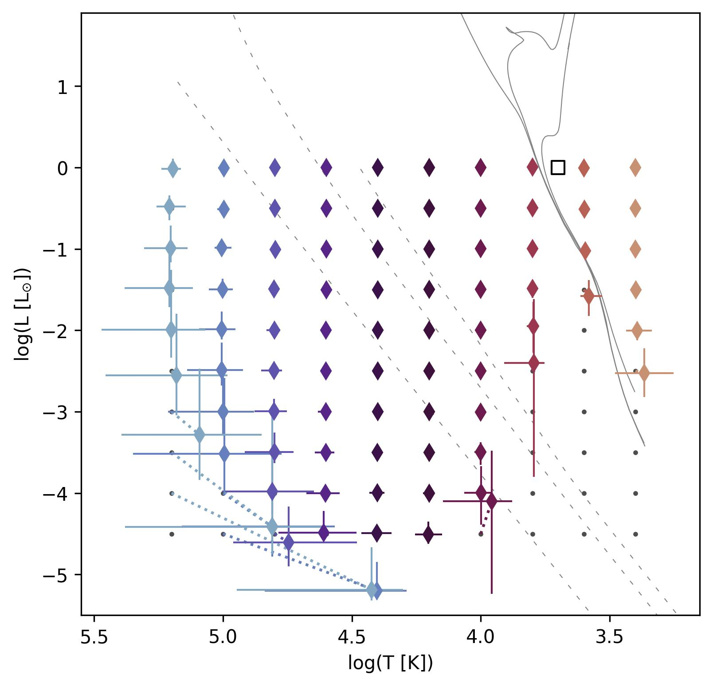
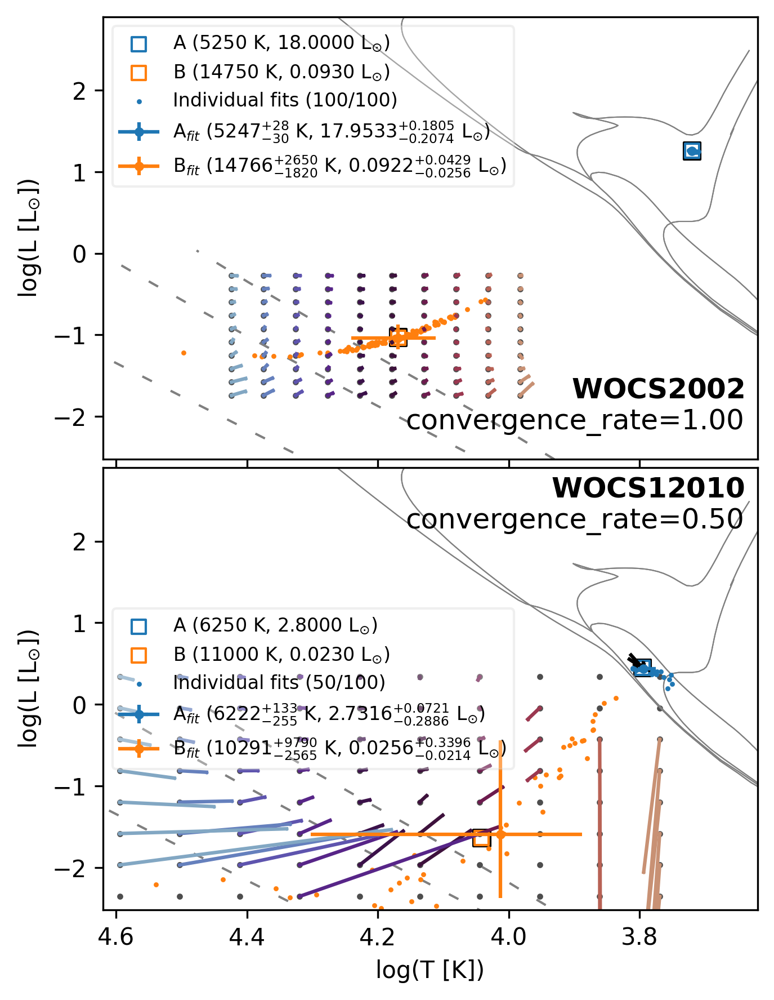

# sed_analysis_tools
A Python module to model, fit and analyse single and binary spectral energy distributions (SEDs). This theory behind the code, and the method it implements, are described in Jadhav (2024, in prep).

### Documentation at [jikrant3.github.io/sed-analysis-tools](https://jikrant3.github.io/sed-analysis-tools)


## Installation
```
pip install sed_analysis_tools
```
Requirements: 
`python`>=3.10, `astropy`>=6.0, `matplotlib`>=3.7, `numpy`>=1.24, `pandas`>=2.0, `scipy`>=1.12, `tqdm`>=1.12

The module will download models (e.g. isochrones) and filter transmission curves as required into a `$HOME/.sed_analysis_tools` (or equivalent) folder.

### Getting started
[getting_started](https://jikrant3.github.io/sed-analysis-tools/getting_started.html) and `examples/` contains some guides and jupyter notebooks. 
The `examples/` also contains the code required to recreate the data and plots given in the publication.

Understanding the recoverability of binary system using SED for a given filter set and noise levels.


Estimating SED fitting errors assuming blackbody approximation. And visualizing the possible degeneracy due to nearby secondaries resulting in similar HRD position.

### Citing sed_analysis_tools
If you use this code for your work, kindly include a citation for this code [](https://doi.org/10.5281/zenodo.13789847)
 and accompanying paper.

Jadhav (2025) _On the detectability and parameterisation of binary stars through spectral energy distributions_, Journal of Astrophysics & Astronomy, in press, [2024arXiv241205606J](https://ui.adsabs.harvard.edu/abs/2024arXiv241205606J/)

```
@software{jikrant3_2024_13789847,
author       = {{Jadhav}, Vikrant V.},
title        = {jikrant3/sed-analysis-tools},
month        = Nov,
year         = 2024,
publisher    = {Zenodo},
version      = {v1.2.0},
doi          = {10.5281/zenodo.13789847},
url          = {https://doi.org/10.5281/zenodo.13789847}
}

@ARTICLE{2024arXiv241205606J,
       author = {{Jadhav}, Vikrant V.},
        title = "{On the detectability and parameterisation of binary stars through spectral energy distributions}",
      journal = {arXiv e-prints},
     keywords = {Astrophysics - Solar and Stellar Astrophysics, Astrophysics - Instrumentation and Methods for Astrophysics},
         year = 2024,
        month = dec,
          eid = {arXiv:2412.05606},
        pages = {arXiv:2412.05606},
archivePrefix = {arXiv},
       eprint = {2412.05606},
 primaryClass = {astro-ph.SR},
       adsurl = {https://ui.adsabs.harvard.edu/abs/2024arXiv241205606J},
      adsnote = {Provided by the SAO/NASA Astrophysics Data System}
}


```
